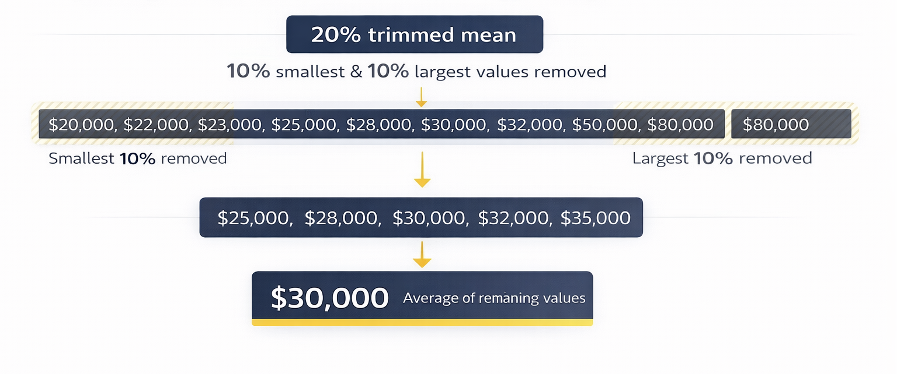
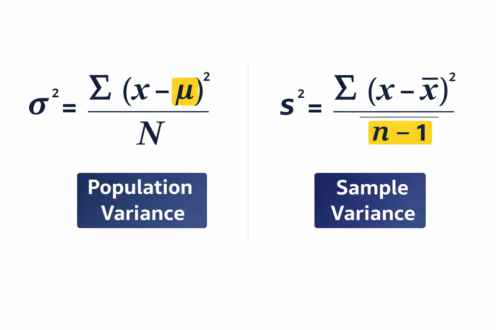
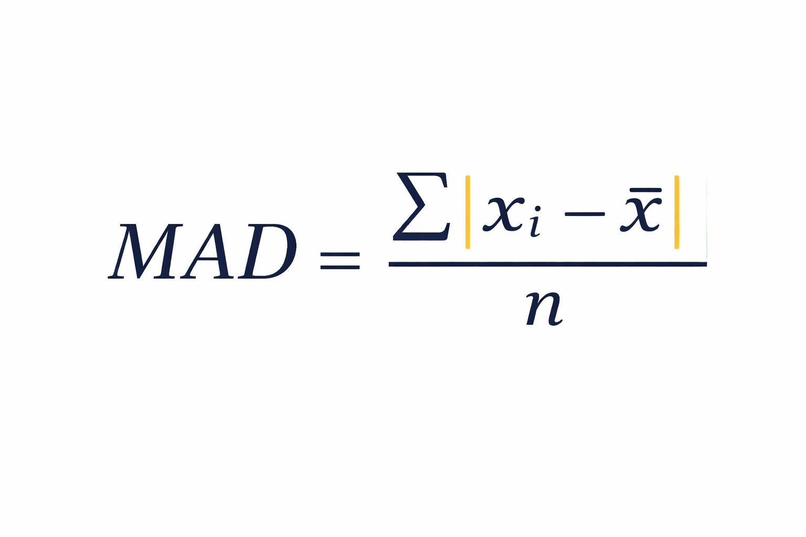
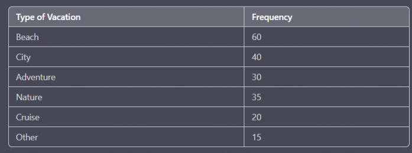
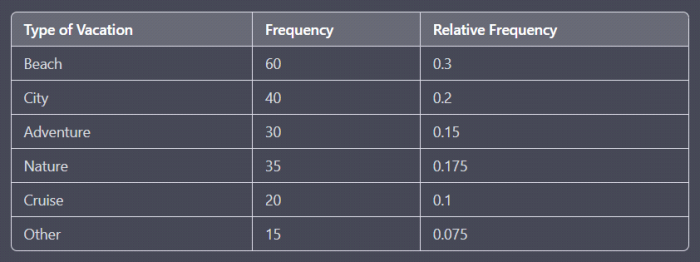
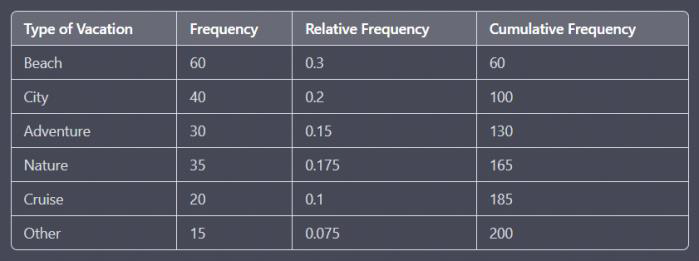
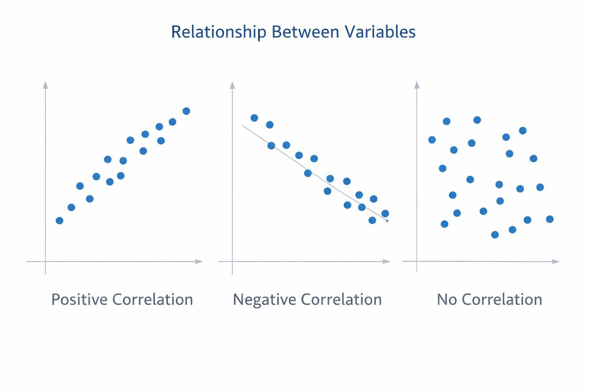

# Statistics for Data Science & Machine Learning

## What is Statistics?

**Statistics** is a branch of mathematics that deals with:

* Collecting data
* Organizing data
* Analyzing data
* Interpreting data
* Presenting data

**In simple words**
Statistics is the method used to **extract insights from data**. <br>

Like :
* You **collect data**
* You **summarize it**
* You **understand patterns**
* You **make decisions or predictions**


---

##  Why is Statistics Important?

Statistics is widely used in:

* **Business & Finance**

  * Customer behavior analysis
  * Demand forecasting
  * Pricing strategy
  * Competitor analysis

* **Medical Sciences**

  * Clinical trials
  * Drug effectiveness testing
  * Treatment comparison

* **Government & Politics**

  * Surveys
  * Opinion polls
  * Population-level estimates

* **Environmental Science**

  * Climate analysis
  * Trend forecasting

* **Machine Learning & Data Science**

  * Most ML algorithms are built on statistical foundations
  * Linear Regression, Logistic Regression, SVM, Naive Bayes all depend on statistics
 
Without statistics → **decision making is impossible**

---

## Types of Statistics

Statistics has **two major branches**:

```
Statistics
├── Descriptive Statistics
└── Inferential Statistics
```

##  Descriptive Statistics

```
Descriptive statistics deals with the collection, organization, analysis, interpretation,
and presentation of data. It focuses on summarizing and describing the main features of
a set of data, without making inferences or predictions about the larger population.
```

> Descriptive statistics focuses on **summarizing and describing existing data**, without making predictions.

It answers:

* What does the data look like?
* What is the center?
* How spread out is the data?


### Examples of Descriptive Statistics

* Mean
* Median
* Mode
* Standard Deviation
* Range
* Graphs (Bar, Histogram, Boxplot)

### Simple Explanation

You already have data → you **describe** it.

Example:

* Average salary in a class
* Median marks
* Distribution of age

---


## Inferential Statistics

```
Inferential statistics deals with making conclusions and predictions about a population based on a sample.
It involves the use of probability theory to estimate the likelihood of certain events occurring, hypothesis testing
to determine if a certain claim about a population is supported by the data, and regression analysis
to examine the relationships between variables
```

> Inferential statistics uses **sample data** to make **predictions or inferences about a larger population**.


### Why Inferential Statistics is Needed

You **cannot study everyone**.

Example:

* India has **140 crore people**
* You cannot ask salary from everyone

So you:

1. Take a **sample**
2. Analyze it
3. **Infer** about the population


### Diagram: Population vs Sample

```
Population (All people)
████████████████████████████████

Sample (Few selected)
███████
```


### Real-Life Example

* Opinion polls before elections
* Clinical trials
* ML model training using limited data

---

##  Population and Sample


###  Population
```
Populationrefers to the entire group of individuals or objects that we are interested in studying.
 It is the complete set of observations that we want to make inferences about. For example,
the population might be all the students in a particular school or all the cars in a particular city.
```
>The **entire group** of individuals or items you want to study.

**Example**

* All people in Bangladesh
* All students in a university
* All cricket fans in Bangladesh


###  Sample
```
A sample, on the other hand, is a subset of the population. It is a smaller group of individuals or
objects that we select from the population to study. Samples are used to estimate characteristics of the population,
such as the mean or the proportion with a certain attribute. For example, we might randomly select 100 students.
```
>A **subset** of the population selected for analysis.

**Example**

* 50,000 people selected from Bangladesh
* Students who attend physical classes
* Fans who watch matches in the stadium
* All cricket fans vs fans who were present in the stadium
* All students vs who visit college for lectures


###  Why Sampling is Needed?

* Studying the entire population is:

  * Time-consuming
  * Expensive
  * Often impossible

**Solution**

* Take a **sample**
* Use statistics to **infer population behavior**


###  Properties of a Good Sample

1. **Large enough**
2. **Random** (no bias)
3. **Representative**

   * Covers all variations (gender, age, region, class, etc.)
     
**Parameter Vs Statistics**
```
A parameter is a characteristic of a population, while a statistic is a characteristic of a sample.
Parameters are generally unknown and are estimated using statistics. The goal of statistical inference is
to use the information obtained from the sample to make inferences about the population parameters.
```

---

##  Types of Data


### Categorical (Qualitative) Data

>Data representing **categories**, not numbers.

**Examples**

* Gender
* Religion
* State
* College branch
* Favorite BPL team

#### a) Nominal Data

* No order
* Categories have no ranking

**Examples**

* Male / Female
* State names

#### b) Ordinal Data

* Has order
* Difference between categories is not measurable

**Examples**

* Ratings (Good, Average, Bad)
* Rank (1st, 2nd, 3rd)


### Numerical (Quantitative) Data

>Data represented by numbers.

#### a) Discrete Data

* Countable
* No decimal values

**Examples**

* Number of students
* Rank (1, 2, 3)

#### b) Continuous Data

* Can take decimal values

**Examples**

* Height
* Weight
* Salary

---

## Descriptive Statistics — Measures of Central Tendency
```
A measure of central tendency is a statistical measure that represents a typical or central value for a dataset.
It provides a summary of the data by identifying a single value that is most representative of the dataset as a whole.
```

>These measures describe the **center** of data.


###  Mean (Average)

> Mean = Sum of values ÷ Number of values


Gives an overall summary of data


**Formula**

```
Mean = (x₁ + x₂ + x₃ + ... + xₙ) / n
```


 **Example**

Data: 2, 4, 6

```
Mean = (2 + 4 + 6) / 3 = 4
```


### Population vs Sample Mean

| Type            | Symbol |
| --------------- | ------ |
| Population Mean | μ      |
| Sample Mean     | x̄     |


**Major Problem of Mean (Outliers)**

**Example:**

```
Salaries: 30k, 32k, 35k, 10,00,000
```

Mean becomes **very high**, but does NOT represent most people. One person earning extremely high salary shifts the average

> Mean is **highly affected by outliers**

### Median


> **Middle value** after sorting data

**Steps**

1. Sort the data
2. Pick the middle value

**Why Median is Important**

* Not affected by outliers
* Better representation when data is skewed


**Example-1 (Odd count)**

```
Data: 2, 4, 6
Median = 4
```


 **Example-2 (Even count)**

```
Data: 2, 4, 6, 8
Median = (4 + 6) / 2 = 5
```

### Mode


> Value that **appears most frequently**

 **When Mode is Useful**

* **Categorical data**
* Discrete numerical data

Examples:

* Most common state
* Most chosen vacation type
* Most frequent product

```
Data: 1, 2, 2, 3, 4
Mode = 2
```


### Weighted Mean

```
The weighted mean is the sum of the products of each value and its weight, divided by the sum of the weights.
It is used to calculate a mean when the values in the dataset have different importance or frequency.
```
> Mean where **different values have different importance (weights)**.


**Example (ML Ensemble)**

| Model             | Prediction | Weight |
| ----------------- | ---------- | ------ |
| Linear Regression | 10 lakh    | 0.2    |
| Random Forest     | 15 lakh    | 0.3    |
| XGBoost           | 12 lakh    | 0.5    |

```
Weighted Mean =
(10×0.2 + 15×0.3 + 12×0.5)
```
**Use Case**

* Ensemble ML models
* Performance scoring

### Trimmed Mean
```
A trimmed mean is calculated by removing a certain percentage of the smallest and largest values from the dataset
and then taking the mean of the remaining values. The percentage of values removed is called the trimming percentage.
```
> Mean calculated after **removing extreme values (outliers)**.



**Example**

* Remove top 20% and bottom 20%
* Calculate mean on remaining data

**Why Trimmed Mean?**

* Reduces effect of outliers
* Used when data is skewed
---
## Measures of Dispersion
```
A measure of dispersion is a statistical measure that describes the spread or variability of a dataset.
It provides information about how the data is distributed around the central tendency (mean, median or mode) of the dataset.
```

>Dispersion tells **how spread out** the data is.

```
Dispersion
├── Range
├── Variance
├── Standard Deviation
├── Mean Absolute Deviation
└── Coefficient of Variation
```

### Range

```
The range is the difference between the maximum and minimum values in the dataset.
It is a simple measure of dispersion that is easy to calculate but can be affected by outliers.
```
> Range = Max − Min

**Example**

```
Data: 2, 5, 10
Range = 10 − 2 = 8
```
**Limitation**

* Extremely sensitive to outliers
* Not reliable alone
  
### Variance
```
The variance is the average of the squared differences between each data point and the mean.
It measures the average distance of each data point from the mean and is useful in comparing the dispersion of datasets with different means.
```

> Variance measures **average squared distance from the mean**

**Why Squared?**

* Prevents positive & negative values from canceling out


**Interpretation**

* Larger variance → more spread
* Smaller variance → more compact data

**Population vs Sample Variance**

| Type                | Formula            |
| ------------------- | ------------------ |
| Population Variance | σ² (divide by N)   |
| Sample Variance     | s² (divide by N−1) |



**Important Interview Point**

* Sample variance uses **N − 1**


### Mean Absolute Deviation (MAD)

> Average absolute distance from the mean



* Less sensitive to outliers than variance
* Cannot be used for inferential statistics


### Standard Deviation
```
The standard deviation is the square root of the variance. It is a widely used measure of dispersion
that is useful in describing the shape of a distribution.
```
> Standard Deviation = √Variance


**Why SD Exists**

* Keeps the **same unit** as the data
* Variance unit is squared
* Standard deviation returns to **original unit**


### Coefficient of Variation (CV)
```
The CV is the ratio of the standard deviation to the mean expressed as a percentage.
It is used to compare the variability of datasets with different means and is
commonly used in fields such as biology, chemistry, and engineering.

The coefficient of variation (CV) is a statistical measure that expresses
the amount of variability in a dataset relative to the mean. It is a dimensionless quantity that is expressed as a percentage.

The formula for calculating the coefficient of variation is:

> CV = (Standard Deviation / Mean) × 100

```
**Why CV is Important**

Allows comparison between **different units**


**Example**

| Column     | Mean  | Std Dev | CV  |
| ---------- | ----- | ------- | --- |
| Salary     | 50k   | 10k     | 20% |
| Experience | 5 yrs | 2 yrs   | 40% |

> Experience is more variable than salary

## Univariate Analysis (One Column)


**Categorical -Frequency Distribution Table & Cumulative Frequency**

A **frequency distribution table** is a table that summarizes the number of times (or frequency) 
that each value occurs in a dataset. Let's say we have a survey of 200 people and we ask them about 
their favourite type of vacation, which could be one of six categories: Beach, City, Adventure, Nature, Cruise, or Other


**Relative frequency** is the proportion or percentage of a category in a dataset or sample. 
It is calculated by dividing the frequency of a category by the total number of observations in the dataset or sample.


**Cumulative frequency** is the running total of frequencies of a variable or category in a dataset or sample. 
It is calculated by adding up the frequencies of the current category and all previous categories in the dataset or sample.


**Graphs**

* Bar Chart
* Pie Chart
* Line Chart (Cumulative)


**Numerical -Frequency Distribution Table & Histogram**

 **Histogram**
* Bin (bucket) size affects histogram shape


## Histogram Shapes
  

## Bivariate Analysis (Two Columns)


### Categorical vs Categorical

* **Contingency Table (Cross-tab)**
  ```
  A contingency table, also known as a cross-tabulation or crosstab, is a type of table used in statistics
  to summarize the relationship between two categorical variables. A contingency table displays the frequencies or
  relative frequencies of the observed values of the two variables, organized into rows and columns.
  ```

**Example (Titanic)**

| Survived | Class 1 | Class 2 | Class 3 |
| -------- | ------- | ------- | ------- |
| Yes      | 136     | 87      | 119     |
| No       | 80      | 97      | 372     |


**Purpose**

* Shows relationship between categories
* Used in **Chi-Square Test**
* Stacked / Side-by-side Bar Charts

### Numerical vs Numerical

* **Scatter Plot**
  

**Shows**
* relationship between variables
* Positive correlation
* Negative correlation
* No correlation


### Categorical vs Numerical

**Options:**

1. Aggregate comparison (mean, max, SD)
2. Bucket numerical variable → Cross-tab
3. Bar charts using aggregation

## Key Takeaways

* Statistics is foundational for ML
* Descriptive → Understand past data
* Inferential → Predict future
* Mean ≠ Always best
* Median preferred with outliers
* Variance & Std Dev show spread
* CV compares variability
* Correct graph depends on data type

---


